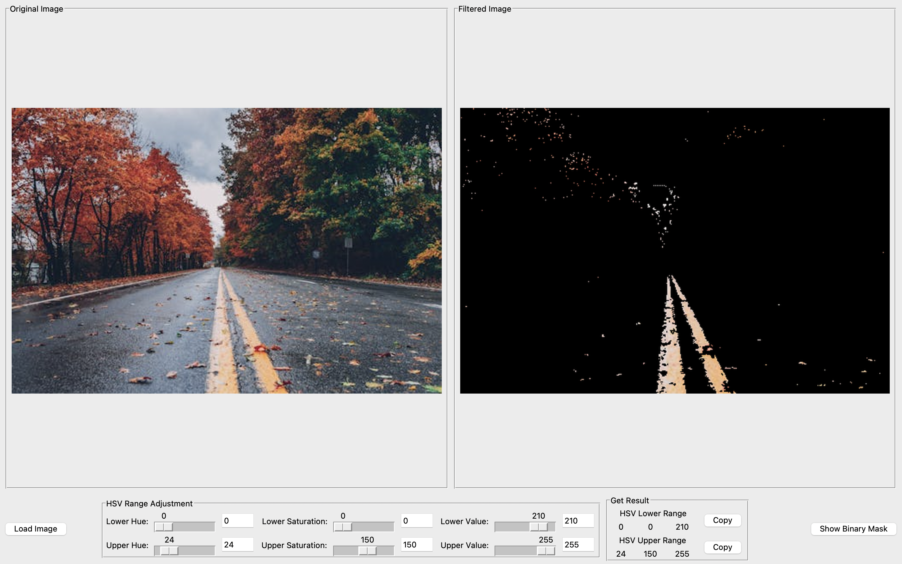
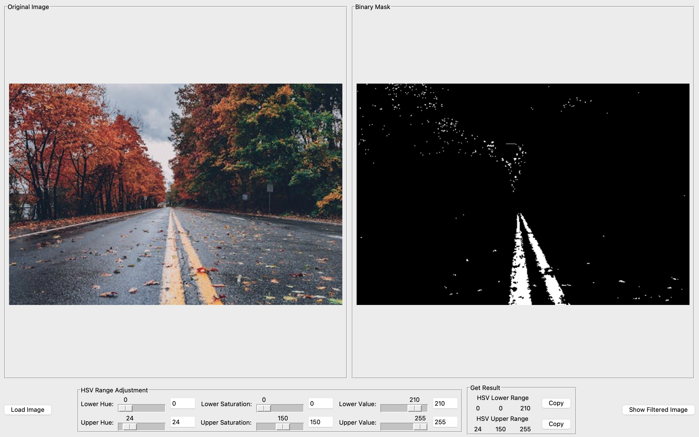

# HSV Range Finder

A powerful, real-time HSV (Hue, Saturation, Value) color range detection tool for computer vision applications. This GUI application allows you to load images and interactively adjust HSV parameters to find optimal color ranges for object detection, color filtering, and image segmentation tasks.


## 📸 Screenshots


### Main Interface


### HSV Adjustment Process


### Different View Modes


## 🌟 Features

### Core Functionality
- **📸 Image Loading**: Cross-platform file dialog supporting PNG, JPG, JPEG, BMP, TIFF formats
- **🎨 Real-time HSV Adjustment**: Interactive sliders for precise color range tuning
- **👁️ Live Preview**: Simultaneous display of original image, filtered result, and binary mask
- **📋 Copy to Clipboard**: One-click copying of HSV values for use in your code
- **🔄 Toggle Views**: Switch between filtered image and binary mask views

### Advanced Features
- **⚡ Performance Optimized**: Intelligent caching and debouncing for smooth real-time updates
- **🛡️ Robust Error Handling**: Comprehensive validation and user-friendly error messages
- **🖥️ Cross-Platform**: Compatible with Windows, macOS, and Linux
- **📏 Large File Support**: Handles large images with memory-efficient processing
- **⌨️ Keyboard Input**: Direct numerical input via entry fields with validation

## 🚀 Quick Start

### Prerequisites

Ensure you have Python 3.7+ installed on your system.

### Installation

1. **Clone the repository:**
   ```bash
   git clone https://github.com/yourusername/HSV_Finder.git
   cd HSV_Finder
   ```

2. **Install required dependencies:**
   ```bash
   pip install opencv-python pillow numpy pyperclip
   ```

3. **Run the application:**
   ```bash
   python main.py
   ```

## 📖 Usage Guide

### Basic Workflow

1. **Launch the Application**
   ```bash
   python main.py
   ```

2. **Load an Image**
   - Click the "Load Image" button
   - Select an image file from the file dialog
   - The image will appear in the left panel

3. **Adjust HSV Parameters**
   - Use the sliders to adjust Lower and Upper HSV values:
     - **Hue (H)**: Color type (0-179)
     - **Saturation (S)**: Color intensity (0-255)  
     - **Value (V)**: Brightness (0-255)
   - Watch the real-time preview in the right panel

4. **Fine-tune Results**
   - Toggle between "Filtered Image" and "Binary Mask" views
   - Use entry fields for precise numerical input
   - Adjust parameters until you achieve desired color isolation

5. **Export HSV Values**
   - Click "Copy" buttons to copy Lower/Upper HSV ranges to clipboard
   - Use these values in your computer vision applications

### Tips for Best Results

- **Start Broad**: Begin with wide HSV ranges and narrow them down
- **Consider Lighting**: HSV values may vary under different lighting conditions
- **Use Value Range**: Adjust the Value (brightness) range for better results
- **Multiple Ranges**: Some colors may require multiple HSV ranges for complete coverage

## 🏗️ Architecture

### Project Structure
```
HSV_Finder/
├── main.py                 # Main application file
├── README.md              # This documentation
└── .git/                  # Git repository data
```

### Code Organization

#### Configuration (`Config` class)
Centralized configuration management for:
- UI layout parameters
- HSV value ranges and defaults
- Performance optimization settings
- Cross-platform file type definitions

#### Main Application (`HSVRangeFinder` class)
Modular architecture with separated concerns:
- **UI Setup**: Window, frames, and widget initialization
- **Image Processing**: OpenCV operations with caching optimization
- **Event Handling**: Slider and user interaction management
- **Error Management**: Comprehensive validation and error handling

### Key Components

| Component | Purpose | Key Features |
|-----------|---------|--------------|
| **Config** | Centralized settings | Constants, defaults, cross-platform support |
| **HSVRangeFinder** | Main application | GUI, image processing, event handling |
| **Image Loading** | File operations | Validation, cross-platform dialogs, error handling |
| **Image Processing** | HSV operations | Caching, debouncing, real-time updates |
| **UI Components** | User interface | Sliders, displays, buttons, responsive layout |

## ⚡ Performance Features

### Optimization Techniques
- **Intelligent Caching**: HSV conversions and processed images are cached
- **Debounced Updates**: Rapid slider changes are debounced (150ms) for smooth performance
- **Lazy Processing**: Only processes when values actually change
- **Memory Management**: Efficient handling of large images with size warnings

### Performance Metrics
- **Update Interval**: 50ms for responsive UI
- **Debounce Delay**: 150ms to prevent excessive processing
- **Large File Threshold**: 50MB with user confirmation
- **Cache Invalidation**: Smart cache clearing when new images are loaded

## 🛠️ Development

### Code Quality Standards
- **Type Hints**: Full type annotation for better IDE support
- **Documentation**: Comprehensive docstrings for all classes and methods
- **Error Handling**: Robust exception handling with user-friendly messages
- **Separation of Concerns**: Modular design with single-responsibility methods

### Dependencies

| Package | Version | Purpose |
|---------|---------|---------|
| `opencv-python` | 4.0+ | Image processing and computer vision operations |
| `pillow` | 8.0+ | Image handling and display conversion |
| `numpy` | 1.19+ | Numerical operations and array handling |
| `pyperclip` | 1.8+ | Clipboard operations for copying HSV values |
| `tkinter` | Built-in | GUI framework (included with Python) |

### Development Setup

1. **Clone and setup development environment:**
   ```bash
   git clone https://github.com/yourusername/HSV_Finder.git
   cd HSV_Finder
   python -m venv venv
   source venv/bin/activate  # On Windows: venv\Scripts\activate
   pip install -r requirements.txt
   ```

2. **Run in development mode:**
   ```bash
   python main.py
   ```

## 📝 API Reference

### Main Classes

#### `Config`
Configuration class containing all application constants and settings.

#### `HSVRangeFinder`
Main application class providing:
- `__init__()`: Initialize the application
- `run()`: Start the application event loop
- `load_image()`: Load and validate image files
- `process_and_display_image()`: Process and display images with HSV filtering
- `cleanup()`: Release resources and close application

### Key Methods

#### Image Processing
```python
def _process_image_safely(image: np.ndarray, lower_bound: np.ndarray, upper_bound: np.ndarray) -> Optional[Tuple[np.ndarray, np.ndarray, np.ndarray]]
```
Process image with HSV filtering, caching, and error handling.

#### HSV Value Management
```python
def _get_validated_hsv_bounds() -> Optional[Tuple[np.ndarray, np.ndarray]]
```
Get and validate current HSV bounds from sliders.

## 🤝 Contributing

We welcome contributions! Here's how you can help:

### Areas for Contribution
- **Feature Enhancements**: New HSV analysis features
- **Performance Improvements**: Optimization and caching enhancements
- **UI/UX**: Interface improvements and user experience enhancements
- **Documentation**: Code documentation and user guides
- **Testing**: Unit tests and integration tests
- **Platform Support**: Enhanced cross-platform compatibility

### Development Guidelines
1. Follow existing code style and documentation standards
2. Add type hints for new functions
3. Include comprehensive docstrings
4. Test changes on multiple platforms
5. Update documentation as needed

### Submitting Changes
1. Fork the repository
2. Create a feature branch: `git checkout -b feature-name`
3. Make your changes with proper documentation
4. Test thoroughly on your platform
5. Submit a pull request with detailed description

## 🐛 Troubleshooting

### Common Issues

#### Import Errors
```
ModuleNotFoundError: No module named 'cv2'
```
**Solution**: Install OpenCV with `pip install opencv-python`

#### Large Image Performance
**Issue**: Slow processing with large images
**Solution**: The application includes automatic warnings for large files (>50MB) and very large images (>10000x10000 pixels)

#### Platform-Specific File Dialog Issues
**Solution**: The application includes platform-specific file type handling for Windows, macOS, and Linux

## 📄 License

This project is licensed under the MIT License - see the [LICENSE](LICENSE) file for details.

## 🙏 Acknowledgments

- **OpenCV Community** for excellent computer vision tools
- **Python Community** for robust libraries and frameworks
- **Contributors** who help improve this project

## 📞 Support

- **Issues**: Report bugs and request features via [GitHub Issues](https://github.com/yourusername/HSV_Finder/issues)
- **Discussions**: Join the conversation in [GitHub Discussions](https://github.com/yourusername/HSV_Finder/discussions)
- **Wiki**: Check the [project wiki](https://github.com/yourusername/HSV_Finder/wiki) for additional documentation

---

**Made with ❤️ for the Computer Vision Community**